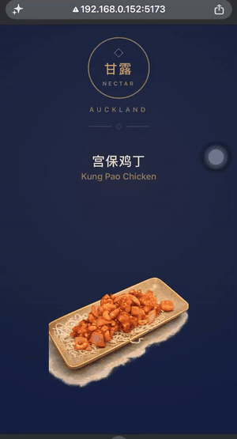

# 甘露 NECTAR · 扫码电子菜单 / Interactive QR Menu

> 点一下菜，它就在盘子里"炸开"成一个个食材——看得懂、看得见过敏原。
> Tap a dish and watch it break apart on the plate into its ingredients — easy to understand, with allergens made visible.

<p align="center">
  
</p>

## 🔗 在线演示 / Live demo

**<https://daftpunnk.github.io/MENU_PROJECT/>** — 手机扫码即开 / scan to open on your phone

<p align="center">
  
</p>

> ⚠️ **品牌说明 / Branding note**：本仓库中的「甘露 / NECTAR」是**虚构的占位品牌**，仅用于公开演示，不代表任何真实餐厅。
> "甘露 / NECTAR" is a **fictional placeholder brand** used only for this public demo; it does not represent any real restaurant.

---

## 💡 灵感来源 / The Idea

**中文**

这个项目源自一个真实场景。作者在奥克兰一家 fine dining 中餐厅做兼职服务员。餐厅一直用传统纸质菜单、没有图片，而客人大约一半是中国人、一半是看不懂中文的外国人。即便菜单是中英双语的，外国客人还是常常不知道一道菜到底是什么，更头疼的是**食材过敏**——纸质菜单根本承载不了这些信息。

于是有了这个想法：做一个**扫码打开、类似 flipbook 的电子菜单**。客人不需要下单，只要点一下某道菜，这道菜就会**分解成它包含的各种食材**（就像点一下芝士汉堡，它会拆成面包胚、牛肉饼、芝士……），每个食材都标注中英文名和过敏原。

**English**

This project grew out of a real problem. The author works part-time as a waiter at a fine-dining Chinese restaurant in Auckland. The restaurant uses traditional paper menus with no photos, while roughly half the guests are Chinese and half are non-Chinese who can't read Chinese. Even with a bilingual menu, foreign guests often have no idea what a dish actually is — and **food allergies** are an even bigger concern that a paper menu simply can't address.

The idea: a **QR-code, flipbook-style digital menu**. No ordering needed — a guest just taps a dish and it **decomposes into its ingredients** (think tapping a cheeseburger and watching it split into bun, patty, cheese…), each labelled in both languages and flagged for allergens.

---

## ✨ 功能 / Features

- 🍲 **点击分解 / Tap to decompose** — 合拢时是一张精致的成菜图，点一下"炸开"成 12 个食材零件，再点收回复原。
  The closed state is a beautiful plated-dish image; tap to explode it into ingredient pieces, tap again to reassemble.
- 🥜 **过敏原标记 / Allergen markers** — 含过敏原的食材描红边、带 ⚠️ 标签（如 tree nut、soy、gluten、alcohol）。
  Allergenic ingredients get a red ring and a ⚠️ badge.
- 🌏 **中英双语 / Bilingual** — 每个食材同时显示中文名和英文名。
  Every ingredient shows both its Chinese and English name.
- 🎨 **品牌视觉 / On-brand design** — 藏青蓝 + 金的 fine-dining 配色，徽标为纯代码绘制的占位标识。
  A navy-and-gold fine-dining palette; the crest is a code-drawn placeholder.
- 🖼️ **真实食材插画 / Real ingredient art** — AI 生成、透明背景的食材图，没有图时自动退回 emoji 占位。
  AI-generated transparent ingredient illustrations, with an automatic emoji fallback.

---

## 🛠️ 技术栈 / Tech Stack

| 用途 / Purpose | 技术 / Tech |
| --- | --- |
| 前端框架 / UI framework | [React 19](https://react.dev) |
| 构建工具 / Build tool | [Vite](https://vite.dev) |
| 样式 / Styling | [Tailwind CSS v4](https://tailwindcss.com) |
| 动画 / Animation | [Framer Motion](https://www.framer.com/motion/) |
| 图像处理流水线 / Image pipeline | Python · [Pillow](https://python-pillow.org) · NumPy · SciPy |

---

## 🚀 本地运行 / Getting Started

```bash
# 安装依赖 / install dependencies
npm install

# 启动开发服务器 / start the dev server
npm run dev

# 打包生产版本 / build for production
npm run build
```

---

## 🧰 图像流水线 / Image Pipeline

食材插画用 AI 生成后，需要抠掉背景、切分、压缩。两个脚本把这条流水线自动化了：
The ingredient illustrations are AI-generated, then need background removal, slicing and compression. Two scripts automate this:

```bash
# 把近白色背景抠成透明 / knock a near-white background out to transparency
python scripts/remove_white_bg.py <输入图 input> <输出图 output>

# 把一张"食材网格图"切成多张透明 PNG / slice a grid sheet of ingredients into separate transparent PNGs
python scripts/slice_ingredients.py src/assets/ingredients_sheet.png src/assets
```

切图脚本会自动探测背景色、按"最大连通透明区域"判定真背景（这样白色食材如糖、淀粉不会被掏空），并按网格顺序命名输出。
The slicer auto-detects the background colour and keeps only the largest connected transparent region as the true background (so white items like sugar and cornstarch don't get punched through), naming outputs in grid order.

---

## 📁 项目结构 / Project Structure

```
data/                      菜品单、酒水单、成分拆解 / food list, drinks list, ingredient breakdowns (JSON)
scripts/                   图像处理脚本 / image-processing scripts (Python)
src/
  App.jsx                  根组件 + 页头(在此改品牌名) / root component + header (rebrand here)
  menu.js                  菜品注册表 / dish registry
  ingredientImages.js      食材图映射 / ingredient image map
  components/
    MenuList.jsx           价目单(菜品/酒水) / price list (food / drinks)
    DishCard.jsx           分解/复原交互 / decompose-reassemble interaction
    IngredientChip.jsx     单个食材零件 / a single ingredient piece
  assets/                  成菜图、食材图 / dish image, ingredient art
```

---

## 📌 状态 / Status

当前是 **可扫码演示阶段**：已上线部署。菜品单按新版菜单收录了全部约 60 道菜（套餐、点心、海鲜、小炒、甜品……），中英双语并带菜单的过敏原标记；其中有写明食材的 40 多道可以点进「点击炸开食材」详情，游水海鲜、儿童餐等只显示品项。酒水单同理，Flox Tail 鸡尾酒可点进拆解。目前只有三道菜有真实成菜图和食材图，其余先用 emoji 占位。
Now a **live, scannable demo**: deployed and online. The food list covers the whole new menu — about 60 dishes across set menus, dim sum, seafood, wok dishes, desserts and more — bilingual and carrying the menu's allergen markers. The 40-odd dishes with listed ingredients open the tap-to-decompose detail view; items such as live seafood and the kids menu are list-only. The drinks list works the same way, with the Flox Tail cocktail opening its breakdown. Only three dishes have real dish/ingredient art so far; the rest use emoji placeholders.

---

## 📝 说明 / Notes

- 品牌「甘露 / NECTAR」为虚构占位，不代表任何真实餐厅。
  The "甘露 / NECTAR" brand is a fictional placeholder and does not represent any real restaurant.
- 菜品图与食材图为 AI 生成的示意插画，用于概念验证。
  Dish and ingredient images are AI-generated illustrations for proof-of-concept purposes.
